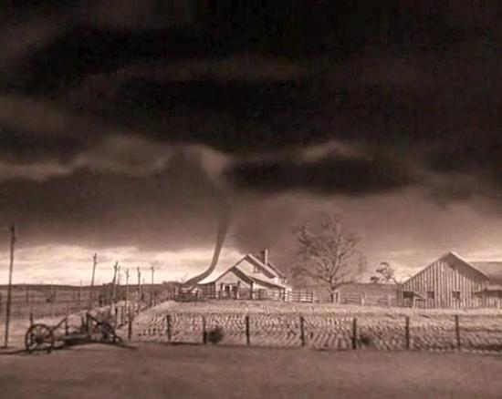

# Tornado-Project

### Group Members:

- **Taylor Bohl**
- **Harish Korrapati**
- **Corey Lawson-Enos**
- **Rhiana Schafer**
- **Ishanjit Sidhu**

### Methods
* Python
* HTML
* Javascript
* Leaflet
* MongoDB

### Dataset:

We pulled data for Level 3 tornados from the last 10 years using the below API. Level 3 tornados have wind speeds between 136 and 165 mph 
(218 and 266 km/h).

https://www.ncdc.noaa.gov/swdiws/

